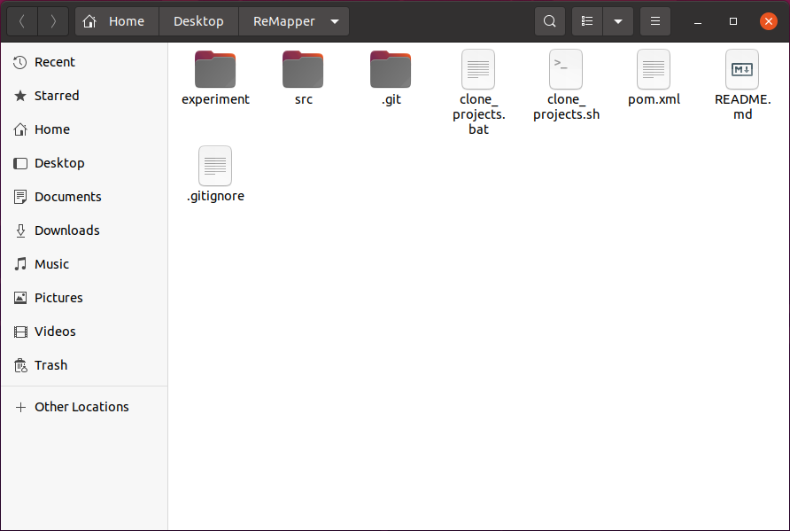
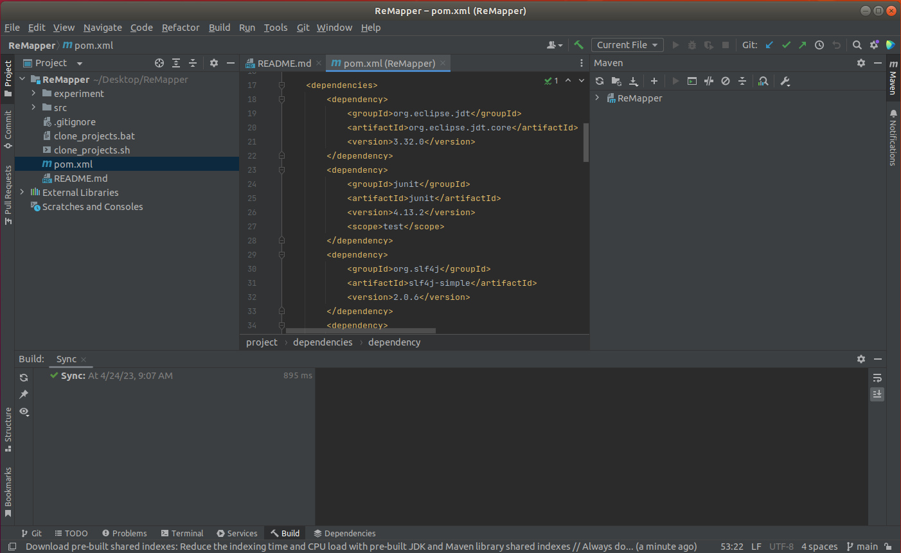
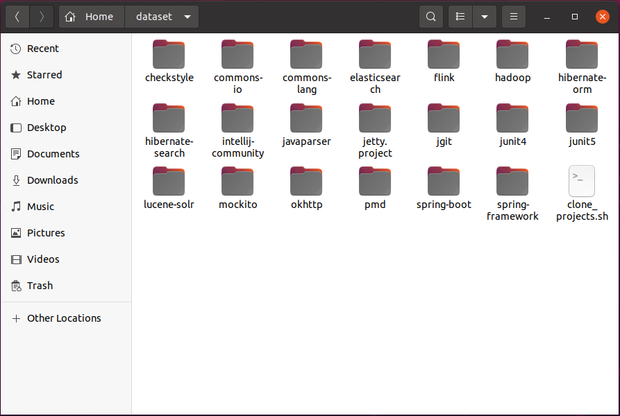
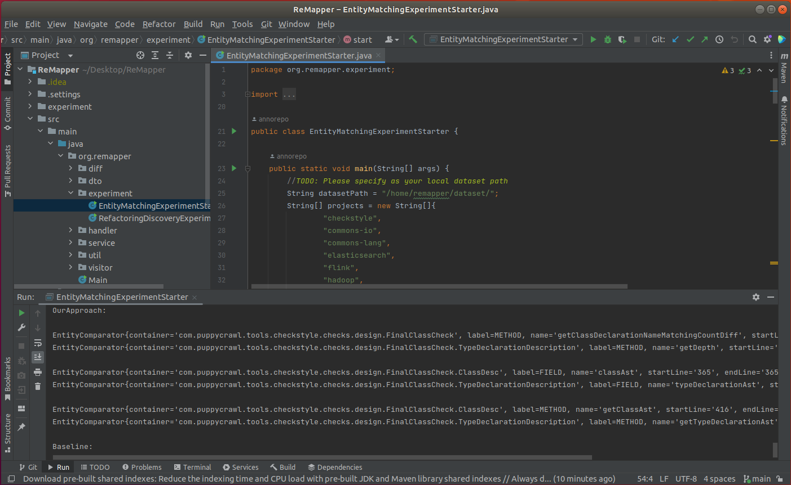
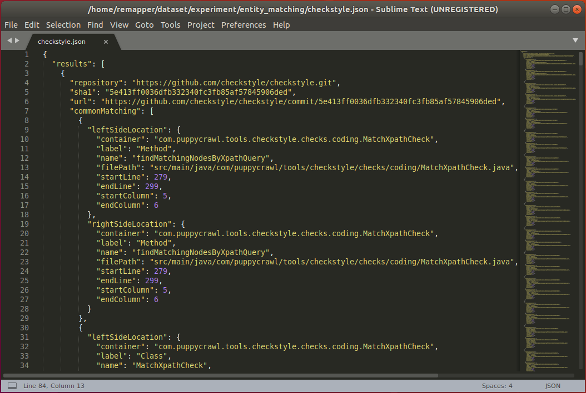
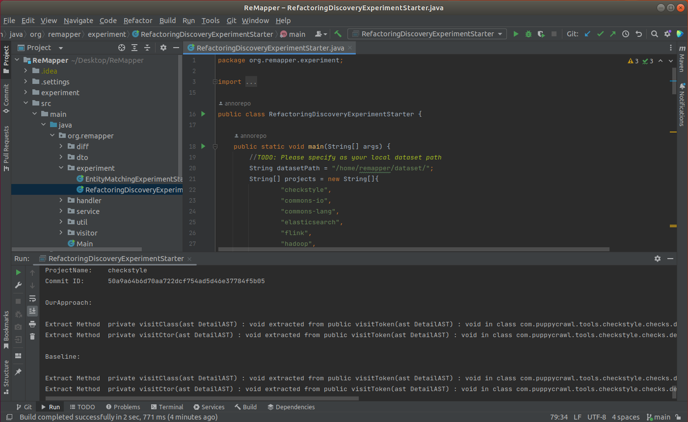
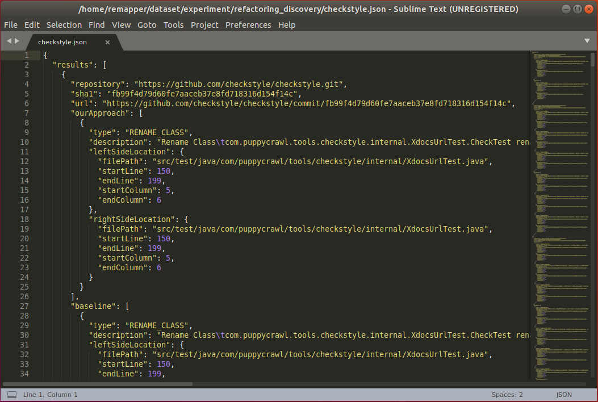

# Table of Contents

- [General Introduction](#General-Introduction)
- [Contents of the Replication Package](#Contents-of-the-Replication-Package)
- [Requirements](#Requirements)
- [How to Replicate the Evaluation?](#How-to-Replicate-the-Evaluation)
- [Experiments](#Experiments)

# General Introduction

This is the replication package for ASE2023 submission, containing both tool and data that are requested by the replication. It also provides detailed instructions to replicate the evaluation.

# Contents of the Replication Package

/src: The implementation of the evaluated approaches (including the proposed approach and the baseline approach).

/experiment: The evaluation results of the proposed approach and the baseline approach.

# Requirements

- Java 11.0.17 or newer
- Apache Maven 3.6.3 or newer

# How to Replicate the Evaluation?

## IntelliJ IDEA

1. **Clone replicate package to your local file system**

   `git clone https://github.com/ReMapper/ReMapper.git`
   
   

2. **Import project**

   Go to *File* -> *Open...*

   Browse to the root directory of project ReMapper

   Click *OK*

   The project will be built automatically.

   

3. **Clone open-source project repositories (dataset)**
   
   `run clone_projects.bat` &nbsp;(on windows environment)
   
   `run clone_projects.sh` &nbsp;&nbsp;&nbsp;(on linux environment)
   
   

4. **Run the entity matching experiment**

   Set  `datasetPath` to the directory where the cloned dataset is located

   From the Project tab navigate to `org.remapper.experiment.EntityMatchingExperimentStarter`

   Right-click on the file and select *Run EntityMatchingExperimentStarter.main()*

   All results of entity matching will be output to the console

   

   All results of entity matching will be stored in the local file system in JSON format:

   `datasetPath/experiment/entity_matching/<project_name>.json` 

   

5. **Run the refactoring discovery experiment**

   Set `datasetPath` to the directory where the cloned dataset is located

   From the Project tab navigate to `org.remapper.experiment.RefactoringDiscoveryExperimentStarter`

   Right-click on the file and select *Run RefactoringDiscoveryExperimentStarter.main()*

   All results of refactoring discovery will be output to the console
   
   
   
   All results of refactoring discovery will be stored in the local file system in JSON format:
   
   `datasetPath/experiment/refactoring_discovery/<project_name>.json` 
   
   

# Experiments

### Entity Matching

All results reported by the proposed approach and the baseline approach as well as the labels manually validated by the developers, are available at the following links:

* [entity matching](experiment/entity_matching/)

Each JSON file represents the results of running entity matching experiments of the proposed approach and the baseline approach separately in a project.

### JSON descriptions

**repository**: Git repository URL  
**sha1**: Git commit ID  
**url**: patch corresponding to the commit  
**commonMatching**: common matched entity pairs reported by the proposed approach and the baseline approach  
**ourApproach**: inconsistent entity pairs reported by the proposed approach against the baseline approach  
**baseline**: inconsistent entity pairs reported by the baseline approach against the proposed approach  
**leftSideLocation**: position of the entity in the old version  
**rightSideLocation**: position of the entity in the new version  
**container**: container in which entity belongs to  
**type**: type of entity  
**name**: name of entity  
**filePath**: file path in which the entity is declared  
**startLine**: start line of entity declaration  
**endLine**: end line of entity declaration  
**startColumn**: start column of entity declaration  
**endColumn**: end column of entity declaration  
**developerConfirmation**: label manually validated by the developers

### Refactoring Discovery

All results reported by the proposed approach and the baseline approach as well as the labels manually validated by the developers, are available at the following links:

* [refactoring discovery](experiment/refactoring_discovery/)

Each JSON file represents the results of running refactoring discovery experiments of the proposed approach and the baseline approach separately in a project.

### JSON descriptions

**repository**: Git repository URL  
**sha1**: Git commit ID  
**url**: patch corresponding to the commit  
**ourApproach**: refactoring operations reported by the proposed approach  
**baseline**: refactoring operations reported by the baseline approach  
**leftSideLocation**: position of the entity in the old version  
**rightSideLocation**: position of the entity in the new version  
**filePath**: file path in which the entity is declared  
**startLine**: start line of entity declaration  
**endLine**: end line of entity declaration  
**startColumn**: start column of entity declaration  
**endColumn**: end column of entity declaration  
**developerConfirmation**: label manually validated by the developers
