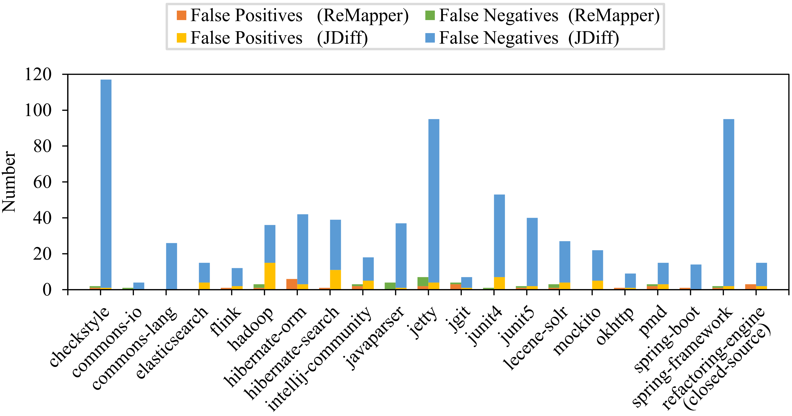

# Evaluation Results

Our evaluation results are presented in Figure 1. The horizontal axis presents the involved projects where the last one (“refactoring-engine”) is the closed-source project whereas others are open-source projects. The vertical axis presents the number of false positives and false negatives as well their sum (i.e., #FP, #FN, and #MST) on each subject project.

&nbsp;&nbsp;&nbsp;&nbsp;**Fig. 1.** Number of Mistakes per Project

From Figure 1, we observe that compared against the pure entity matching algorithm JDiff, ReMapper substantially reduced the frequency of mistakes: The total number of mistakes (i.e., #MST) was reduced from 738 to 68, with a substantial reduction of 90.8%=(738-68)/738. On average, the number of false positives per project was reduced by 51.4%=(3.5-1.7)/3.5 and the number of false negatives per project was reduced by 95%=(31.7-1.6)/31.7. We performed a significance test to validate whether there is a statistically significant difference between the total number of mistakes caused by the two approaches. Our evaluation results (p-value=3.41E-5 and effect size of Cohen's d=1.48) confirmed that the reduction in #MST was statistically significant. 

We further investigated their performance on matching different categories of software entities, i.e., "classes", "interfaces" and "methods". (Notably, JDiff currently supports entity matching at the class, interface, and method levels only) The evaluation results are presented in Table 1. We observe from Table 1 that ReMapper outperforms JDiff on all of the involved entity types. We also notice that ReMapper resulted in high precision and recall on all of the entity types. The minimal precision (on "method") was 99.21%, and the minimal recall (on "method") was 99.38%. It may suggest that ReMapper worked well on all entity types. The evaluated approaches reported the highest numbers of mistakes in matching entities of  "method". It is reasonable because the numbers of involved methods are significantly larger than those of classes, interfaces.

&nbsp;&nbsp;&nbsp;&nbsp;**Table 1** Performance Per Entity Type

<table>
	<tr>
	    <td>Entity Type</td>
	    <td>Approaches</td>
	    <td align="right">#MST</td>
        <td align="right">#FP</td>
        <td align="right">#FN</td>
        <td align="right">#Precision</td>
        <td align="right">#Recall</td>
	</tr>
	<tr>
	    <td rowspan="3">Class</td>
	    <td>ReMapper</td>
	    <td align="right">0</td>
        <td align="right">0</td>
        <td align="right">0</td>
        <td align="right">100%</td>
        <td align="right">100%</td>
	</tr>
	<tr>
	    <td>JDiff</td>
	    <td align="right">77</td>
        <td align="right">0</td>
        <td align="right">77</td>
        <td align="right">100%</td>
        <td align="right">94.95%</td>
	</tr>
	<tr>
	    <td>^ Improvement</td>
	    <td align="right">77</td>
        <td align="right">0</td>
        <td align="right">77</td>
        <td align="right">0</td>
        <td align="right">5.05%</td>
	</tr>
	<tr>
	    <td rowspan="3">Interface</td>
        <td>ReMapper</td>
	    <td align="right">0</td>
	    <td align="right">0</td>
        <td align="right">0</td>
        <td align="right">100%</td>
        <td align="right">100%</td>
	</tr>
	<tr>
	    <td>JDiff</td>
	    <td align="right">8</td>
        <td align="right">0</td>
        <td align="right">8</td>
        <td align="right">100%</td>
        <td align="right">92.08%</td>
	</tr>
	<tr>
	    <td>^ Improvement</td>
	    <td align="right">8</td>
        <td align="right">0</td>
        <td align="right">8</td>
        <td align="right">0</td>
        <td align="right">7.92%</td>
	</tr>
    <tr>
	    <td rowspan="3">Method</td>
	    <td>ReMapper</td>
	    <td align="right">48</td>
        <td align="right">27</td>
        <td align="right">21</td>
        <td align="right">99.21%</td>
        <td align="right">99.38%</td>
	</tr>
	<tr>
	    <td>JDiff</td>
	    <td align="right">653</td>
        <td align="right">73</td>
        <td align="right">580</td>
        <td align="right">97.47%</td>
        <td align="right">82.92%</td>
	</tr>
	<tr>
	    <td>^ Improvement</td>
	    <td align="right">605</td>
        <td align="right">46</td>
        <td align="right">559</td>
        <td align="right">1.74%</td>
        <td align="right">16.46%</td>
	</tr>
</table>

All results reported by the pure entity matching algorithm (JDiff) as well as the labels manually validated by the developers, are available at the following links:

* [entity matching](entity%20matching/)